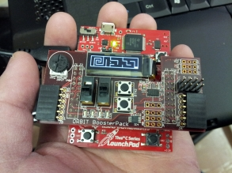

# LAByrinth

## Description 
LAByrinth was written for the final *lab* project of SE101, Introduction to Methods of Software Engineering. It features both the use of I2C serial communication to interact with the accelerometer and parallel communication in order to interact with the switches, buttons and the analog-to-digital converter.

The only requirement given for this project was that it had to revolve around an Arduino clone, the [TI C Series Launchpad](https://www.ti.com/ww/en/launchpad/launchpads-connected-ek-tm4c123gxl.html), and an extension-module, the Digilent Orbit Boosterpack. The Boosterpack came with an accelerometer, potentiometer, various buttons and switches, and a display.

In this project, a hardware clone of a popular tabletop game, [labyrinth](https://en.wikipedia.org/wiki/Labyrinth_\(board_game\)) was created. A "ball" is rolled around by a user whose goal is to navigate the ball to the finish without hitting any pitfall which will cause a player to lose.

## Images

## Challenges
There were many challenges faced during this project. At first, not all members were familiar with the tools and technologies that were used in this project. As a result, the first few meetings were spent familiarising everyone with what was being used.

In addition, there was very little documentation on the usage of the Boosterpack. The only documentation provided was badly commented example code. As a result, creating the abstraction layer for the hardware took many hours of trial and error. 

## Improvements
* Randomly generate maps instead of using hard-coded maps.
* Organise file-structure in order to group files more logically (such as by hardware, gamelogic, etc).

## Contributors
* [Matt D'Souza](https://github.com/DSouzaM)
* [Valeria Hernandez](https://github.com/valeria1993)
* [Jing Li](https://github.com/jingyli)
* [Denton Liu](https://github.com/Denton-L)
* [Holly Oegema](https://github.com/heoegema)
